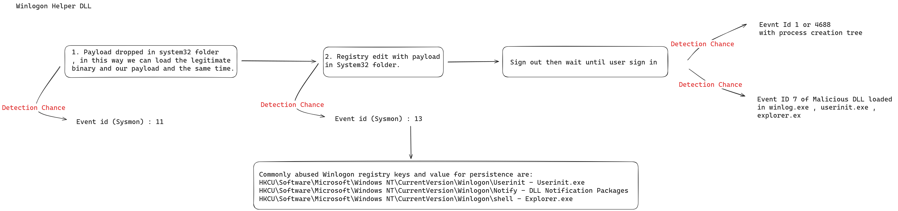

## Description

Winlogon is a core Windows component that manages user logon/logoff and the secure attention sequence (Ctrl+Alt+Delete). It supports **Winlogon helper programs** through specific registry keys, which allow DLLs to be loaded during critical system events.

Adversaries can abuse these keys to gain **persistence** by loading malicious code during system startup or user logon.

### Commonly Targeted Registry Paths

- **Winlogon\\Notify**  
  Defines notification package DLLs that Winlogon loads during logon/logoff events.  
  Malicious entries can be created at:  
  `HKLM\Software\Microsoft\Windows NT\CurrentVersion\Winlogon\Notify\`  
  with a `DllName` value pointing to the attacker's DLL.

- **Winlogon\\Userinit**  
  Specifies post-authentication executables.  
  Attackers may append malicious binaries (e.g., `userinit.exe,C:\malware.exe`) to gain persistence.

- **Winlogon\\Shell**  
  Sets the default shell (usually `explorer.exe`).  
  Attackers can change or append commands (e.g., `explorer.exe,cmd.exe`) to execute malicious payloads at logon.

## Impact

This technique allows persistent execution of malicious code at logon with SYSTEM privileges, often without user awareness. It is a stealthy and reliable method to maintain access.

## Privileges Required

- Administrator rights are required to modify `HKLM\...Winlogon\*`.
- User-level persistence is possible via `HKCU\...Winlogon\*` under limited privileges.

## Data Sources for Detection

- **Sysmon**
  - Event ID 12: Registry object create/delete
  - Event ID 13: Registry value set
  - Event ID 14: Registry key renamed

- **Windows Security Logs**
  - Event ID 4657: Registry value modified  
    > Requires auditing to be enabled on relevant keys

## Detection Strategy

### Detection & Hunting Logic

- Monitor for modifications to:
  - `HKLM\Software\Microsoft\Windows NT\CurrentVersion\Winlogon`
  - `HKLM\Software\Wow6432Node\Microsoft\Windows NT\CurrentVersion\Winlogon`
- Focus on suspicious changes to `Userinit`, `Shell`, or any `Notify\*` DLL registration.
- Validate against known legitimate DLLs (e.g., ScCertProp, WgaLogon).
- Investigate DLL paths outside of `%SystemRoot%\System32`.

### Sigma Detection Rule : **Link:** [Sigma Rule – Boot or Logon Autostart Execution : Winlogon Helper DLL](https://github.com/N1ghtFury74/Sigma-Rules-/blob/main/Boot%20or%20Logon%20Autostart%20Execution/Winlogon%20Helper%20DLL/Srule.Yaml)

## Hunting Playbook

### Tool: Velociraptor

Use the Velociraptor artifact:  
[SysmonRegistry Artifact – Velociraptor Exchange](https://docs.velociraptor.app/exchange/artifacts/pages/sysmonregistry/)

### Registry Keys to Investigate

Collect and analyze values from the following registry paths:

- `HKLM\Software\Microsoft\Windows NT\CurrentVersion\Winlogon\`
- `HKLM\Software\Wow6432Node\Microsoft\Windows NT\CurrentVersion\Winlogon\`
- `HKCU\Software\Microsoft\Windows NT\CurrentVersion\Winlogon\`

Focus on these values:

- **Winlogon\Notify**  
  Points to notification package DLLs that handle Winlogon events.

- **Winlogon\Userinit**  
  Should point to `userinit.exe`, the program executed when a user logs in.

- **Winlogon\Shell**  
  Should point to `explorer.exe`, the system shell started at logon.

### Hunting Strategy

- For `winlogon.exe`, examine loaded DLLs and verify their digital signatures. Unusual or unsigned DLLs are suspicious.
- For `Userinit` and `Shell`, if the values reference anything other than `userinit.exe` or `explorer.exe`, this is a strong indicator of malicious activity.

---

## Resources

- [Malware development: persistence - Winlogon](https://cocomelonc.github.io/tutorial/2022/06/12/malware-pers-7.html)
- [Red Team Notes – Winlogon Helper DLL](https://dmcxblue.gitbook.io/red-team-notes-2-0/red-team-techniques/persistence/t1547-boot-or-logon-autostart-execution/winlogon-helper-dll)
- [iRed Team – Winlogon Persistence](https://www.ired.team/offensive-security/persistence/windows-logon-helper)
- [Xcyclopedia – Winlogon.exe](https://strontic.github.io/xcyclopedia/library/winlogon.exe-E8B1A6B8C6EA5972C123A816DF237AF8.html)
- [Microsoft Documentation – Winlogon Notification Package](https://learn.microsoft.com/en-us/windows/win32/secauthn/creating-a-winlogon-notification-package)
- [Exploring Windows Process Tree](https://medium.com/@rihanmujahid46/exploring-windows-process-tree-genealogy-df107b59b018)

---

## Draft Notes

### TTP Requirements

- Because this technique is triggered during the logon/logoff process, any DLL used as a notification package must be placed in the `System32` directory to function legitimately alongside the standard system binaries.
- Administrator privileges (Local Admin is enough) are required to modify thess key effectively.
- A malicious file (such as a DLL or executable) is typically created on disk **prior to** being registered under the targeted Winlogon registry keys. This activity can be detected using **Sysmon Event ID 11**, which captures file creation events.

### Detection Logic
 

### Initial Detection Approach

- Leverage **registry monitoring** to detect the creation or modification of keys associated with persistence mechanisms.
- Use **process and DLL monitoring** to identify the execution of payloads triggered during logon.
- Establish an allowlist of known legitimate `Winlogon\Notify` subkeys (e.g., `ScCertProp`, `WgaLogon`) to reduce false positives.
- Monitor the **process tree** involving `winlogon.exe` and `userinit.exe` for abnormal child processes or behavior.
- DLL Loading Focus
    - Focus on DLLs loaded by `winlogon.exe`, as this process is directly responsible for loading notification packages.
    - Monitoring DLL loads from `userinit.exe` or `explorer.exe` may overlap with unrelated persistence or injection techniques.
    - To reduce false positives, narrow the scope to `winlogon.exe` and cross-reference with Microsoft’s implementation requirements:
  - DLLs must be placed in `%SystemRoot%\System32`. A registry key must be created under `Winlogon\Notify` with a `DllName` value

### Conclusion

Through research and testing, we confirmed that any DLLs or executables used in this technique must first be written to disk and then registered via specific Winlogon-related registry keys. This observation directly informs the detection logic and will be applied in the Sigma rule development

> Reference: [Microsoft Winlogon Notification Package Guide](https://learn.microsoft.com/en-us/windows/win32/secauthn/creating-a-winlogon-notification-package)
